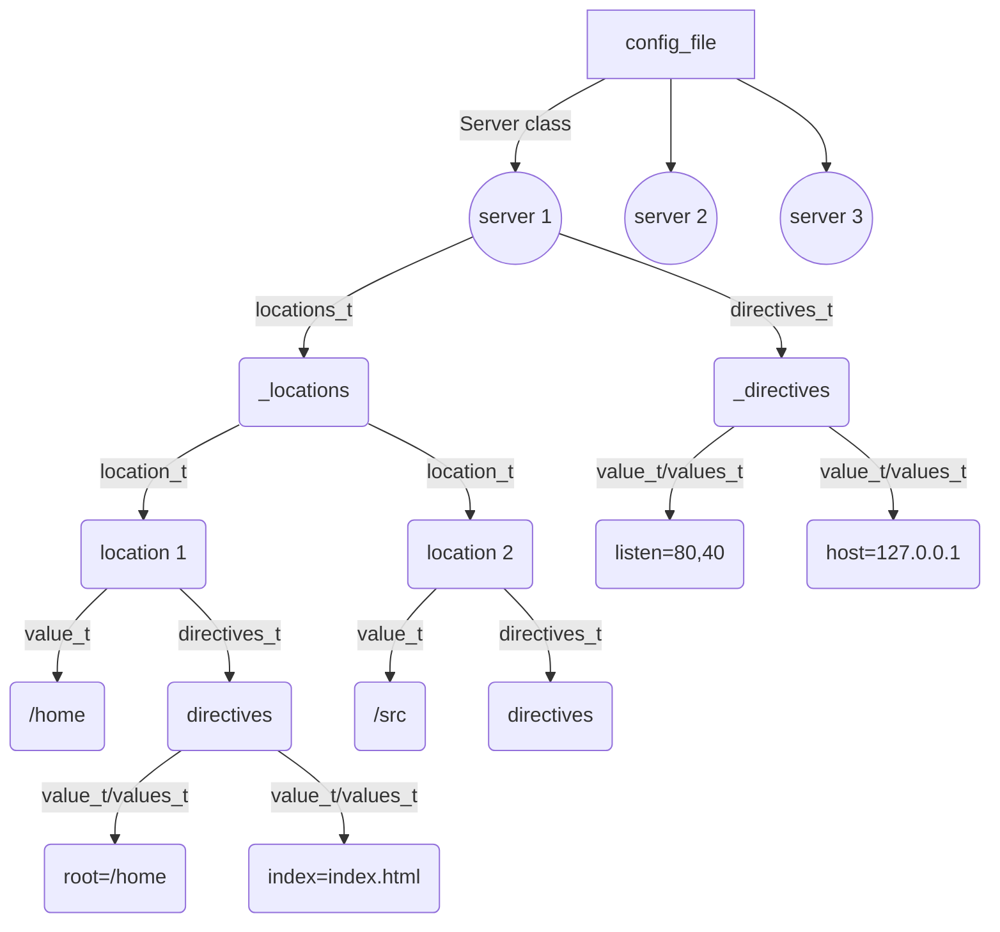

#### This is a basic example of config file:
```
server {
	listen 80 40; 
	host 172.0.0.1; 
	location /home {
		root /home;
        index index.html;
	}
    loaction /src {

    }
}
server {}
server {}
``` 


#### This is the AST (abstract syntax tree) of the above config file.


<br></br>
---

## Parsing the config file :
#### Start by initalizing a config object:
```
Config conf(path/to/config/file);
```
### Getting servers :
```
servers_t servers = conf.getServers();
```
#### this will return a list of servers.

### Get dirctives values (ex: listen) of each server.
```
servers_it it = servers.begin();
values_t ports;
for (; it != servers.end(); it++)
{
    ports = servers.getPorts();
    // do something with ports.
}
```
Each server has an appropriate getters for different directive values.

### Getting locations of a single server:
```
locations_t locations = servers.begin()->getLocations();
```
#### this returns a map that represent the locations of the first server block in the config file, where the key is the location path, and the value is a Location class, where you can get the values of its directives with the appropriate getter.

```
value_t root;
locations_it it = locations.begin();
for (; it != loactions.end(); it++)
{
    root = it->getRoot();
    // do something with root
}
```
#### this will loop on all the locations and get the root directive of each location, simillary you get any possible directive value with the appropriate getter.

```
servers_it it = servers.begin();
try {
    value_t root = it->at(<path>).getRoot();
}catch (std::exception &) {
    //std::cout << "No loaction match!" << std::endl;
}
```
#### this will return the root of the loaction that has <path> as a key in the first server block, if no location is matched, the (at) method will throw an exception, it is up to you to handle it.

## Server Getters:

|Directive                |Getter                          |Return                    | params | description |
|----------------|-------------------------------|------------|------------|-------------------------------|
|listen          |`getPorts();`                  |values_t             | void | ...|
|host            |`getHost();`                   |value_t            |void | ...|
|server_names    |`getServerNames();`            |values_t |void | ...|
|error_page    |`getErrorPage();`                |values_t |void | ...|
|client_max_body_size    |`getMax();`            |value_t  |void | ...|

### In addition, these are some other methods for the Server class:

`at(std::string location)` : This search for the location in the the all the locations of the server, and return the <Location> object. if no location to be found it will throw an exception.
<br>
`locations_t     &getLocations();` : This will return  a map of locations, where the key is the path and the value is a <Location> class.
<br>
`directives_t    &getDirectives();`: This will return a map the represent the directives of the server, with a <value_t>key (ex: listen) and <values_t>values (ex: 80 40), the values is a set of <value_t> strings.

## Location Getters:

|Directive                |Getter                          |Return                   |params | description |
|----------------|-------------------------------|------------|------------|-------------------------------|
|allow          |`isAllowed(Req req);`                  |bool             |Req | ...|
|return            |`getRedirect();`                   |values_t            |void | ...|
|root    |`getRoot();`            |value_t                                    |void | ...|
|autoindex    |`isAutoIndex();`                 |          bool |void | ...|
|index    |`getIndex();`            |values_t  |void | ...|

### In addition, these are some other methods for the Location class:
`getLocations();` : This will return a map that represent the directives of the location in a key<value_t> / values<values_t>.


## Important Types :
- value_t : string.
- values_t : set of strings.
- servers_t : list of Server.
- directives_t: map of value_t/values_t
- locations_t : map of value_t/Loation